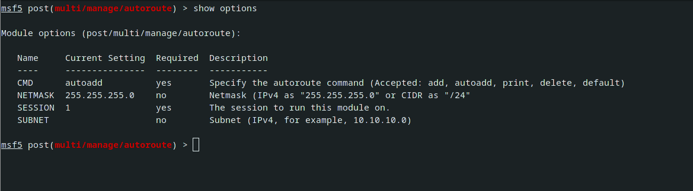

 Metasploit & Routing

post exploitation module is kiwi

>load kiwi

# Routing in metsploit
using post module in it

>post/multi/manage/autoroute

This will show you the route of the system
Then

>run autorun -h

to see the options for adding route

so here we add the following as per 172.18.1.0/24

`run autoroute -s 172.18.1.0 -n 255.255.255.0`
-s - subnet
-n - netmask
